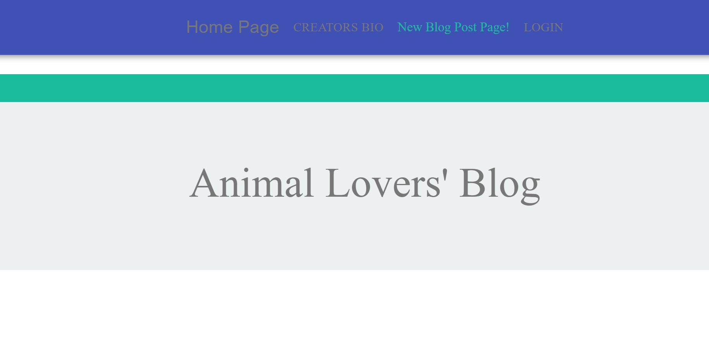
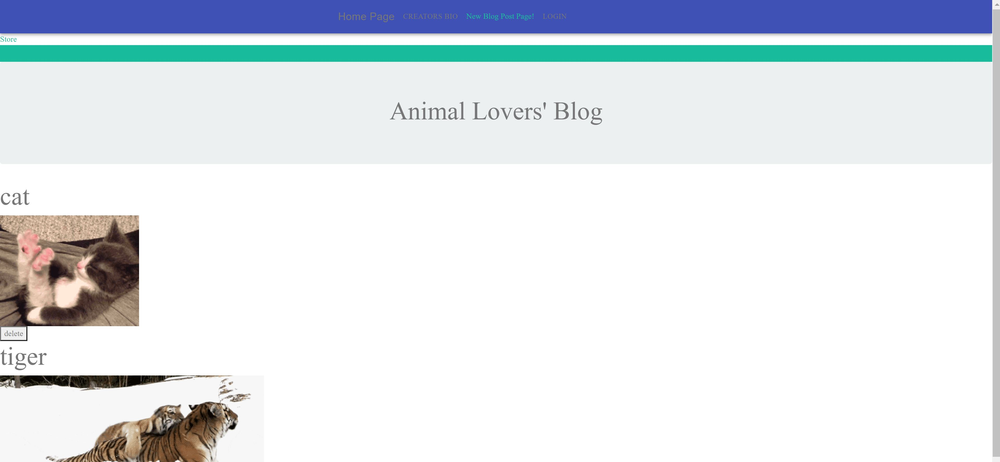
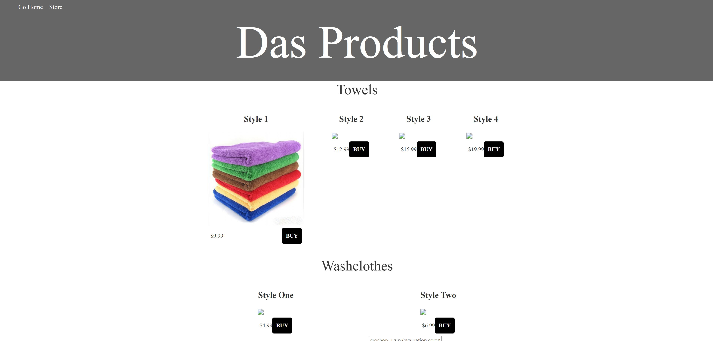

# Animal Lovers' Blog

I have created an app that not only shares user input from around the world but also posts a funny gif to lighten the mood. Along with this my app has a E-commerce platform for users to buy animal products such as food and toys for a variety of animals.

* Animal Lovers' Blog helps user to save their desired animal with a notes

* Animal Lovers' Blog lets user to delete their entry

* Animal Lovers' Blog displays all the previous and current entry 

* Animal Lovers' Blog has a link called "Store", that takes you to a E-Commerce site where you can buy products for that specific Animal.

* Animal Lovers' Blog Store lets you create a cart to order multiple products at the same time.

## video presentation 
    N/A

## Instructions

#### App Setup

1. Create a GitHub repo called `blog_app` and clone it to your computer.

2. Make a package.json file by running `npm init` from the command line.

3. Install the Express npm package: `npm install express`.

4. Create a server.js file.

5. Install the Handlebars npm package: `npm install express-handlebars`.

6. Install MySQL npm package: `npm install mysql`.

7. Require the following npm packages inside of the server.js file:
   * express

#### DB Setup

1. we have created a mongoDB account.

2. we used API to connect to the db and store data

#### Config Setup

1. Inside your `blog_app` directory, create a folder named `config`.

2. Create a `connection.js` file inside `config` directory.

   * Inside the `connection.js` file, setup the code to connect Node to MySQL.

   * Export the connection.

3. Create an `orm.js` file inside `config` directory.

   * Import (require) `connection.js` into `orm.js`

   * In the `orm.js` file, create the methods that will execute the necessary MySQL commands in the controllers. These are the methods you will need to use in order to retrieve and store data in your database.

     * `selectAll()`
     * `insertOne()`
     * `updateOne()`

   * Export the ORM object in `module.exports`.

#### Controller setup

1. Inside your `blog_app` directory, create a folder named `controllers`.

2. In `controllers`, create the `burgers_controller.js` file.

3. Create the `router` for the app, and export the `router` at the end of your file.

## Build status
project still in development phase

    Build status of continus integratio
    tools: (to be used):
        1. jenkins
        2. heroku
    

## Code style

## Tech/framework used
    node.js
    ReactJS

## Features

    1. user friendly
    2. simplified 
    3. Easy Navigation
    4. SEO (Search Engine Optimization)
    5. Mobile Friendly

## Code Example

    1. Used consistent indentation
    2. Followed the DRY Principle
    3. Avoided Deep Nesting
    4. kept Limited line length
    5. standard File and folder structure
    6. standard Naming conventions.
    7. Kept the code simple.

## Installation

    To run the template engine: npm Start 
    (local deployment)

## Screenshot

Screenshot

## API Reference

    https://developers.giphy.com/
    https://www.npmjs.com/package/inquirer
    https://www.npmjs.com/package/console.table 

## Tests
    N/A

## Developers Info

* Amith Das
* LinkedIn : https://www.linkedin.com/in/amith-das-1775b1170/
* GitHub : https://github.com/dasamith

## Credits
upenn coding bootcamp

## License
A short snippet describing the license (MIT, Apache etc)

MIT © [Amith Das]()